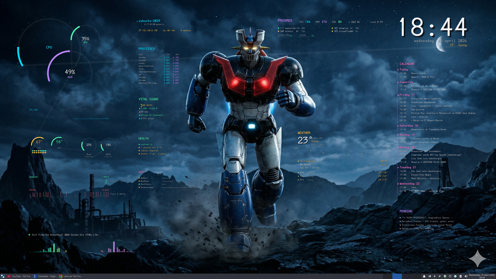

<div align="center">

**🇬🇧 English** · [🇪🇸 Español](README.es.md)

# 🤖 Modern Conky Dashboard

### *Cockpit-style control panel for Linux, rendered with Cairo on Conky*


`#conky` `#linux-desktop` `#cairo` `#lua` `#dashboard` `#rice` `#proxmox` `#obsidian` `#garmin` `#widgets` `#portfolio`

</div>

---

## ✨ What is this?

A **desktop dashboard** that draws itself as a full-screen transparent overlay on top of your wallpaper, combining local monitoring (CPU, RAM, GPU, network, disks), remote services (Proxmox, Google Calendar) and personal sources (Obsidian, Garmin) into a single panel with an *organic layout* aesthetic — no grids, no boxes, large fonts and curved shapes that respect the wallpaper's role.

Designed for **4K** displays with automatic scaling to any resolution through a single parameter `s = width / 3840`.

---

## 📸 Screenshot



> *Mazinger Z as the main subject · widgets flowing around without invading it*

---

## 🎯 Features

- 🧭 **Full-screen overlay** transparent, `own_window_type = desktop`, doesn't steal focus.
- 📐 **Responsive scaling** — a single parameter adapts the whole panel to any resolution.
- 🎨 **Cairo rendering** — circular gauges, sparklines, smooth bars, subtle text shadow for legibility over complex wallpapers.
- ⚡ **Low footprint** — per-widget smart caches (2s to 30min) and Lua-cached processes.
- 🔌 **17-widget composable architecture** via `draw_*` functions declared in `conky_main()`.
- 🌐 **Heterogeneous data sources** — Proxmox API, Google Calendar (gcalcli), Obsidian vault, Garmin (via Obsidian), wttr.in, CAVA audio pipe, hwmon sensors, systemd, journalctl, git, docker…

---

## 🧩 Included widgets

| # | Widget | Function | Source | Description |
|---|--------|----------|--------|-------------|
| 1 | 🕐 **Clock** | `draw_clock` | `${time}` | Large digital clock + date + mini weather |
| 2 | 📊 **Cluster** | `draw_cluster` | Conky built-in | Overlapping circular gauges CPU/RAM/GPU with per-core dots |
| 3 | 🌡️ **Temps** | `draw_temps` | hwmon + nvidia | CPU/GPU thermometers with per-core heatmap |
| 4 | 💾 **Storage** | `draw_storage_gauges` | `df -h` | Ring per partition (up to 3) |
| 5 | 🌐 **Network Graphs** | `draw_net_graph` | Conky `${downspeed}` | Dual Down/Up graph with 200-sample history |
| 6 | 🖥️ **System Info** | `draw_sysinfo` | `/etc/os-release`, lscpu | Hostname, kernel, IP, uptime + apt upgradables counter |
| 7 | ☁️ **Proxmox** | `draw_proxmox` | Proxmox REST API | Banner with node CPU/MEM/DSK + running guests + storage |
| 8 | ❤️ **Garmin** | `draw_garmin` | Obsidian vault | Body Battery, HR, stress, steps parsed from daily note |
| 9 | 📅 **Calendar** | `draw_calendar` | gcalcli | Upcoming 30-day events grid |
| 10 | 📌 **Pending** | `draw_pending` | Obsidian | In-progress / planned topics list |
| 11 | 🎵 **Now Playing** | `draw_np_vis` | MPRIS + CAVA | Title/artist + 64-bar audio visualizer |
| 12 | 📈 **CPU History** | `draw_cpu_history` | Conky | CPU load history bar chart |
| 13 | ⚡ **Processes** | `draw_procs` | Conky `${top}` | Top 5 processes by CPU with MEM % |
| 14 | 🎨 **Flow Lines** | `draw_flow_lines` | — | Curved Bezier connector lines between elements |
| 15 | 🩺 **Health** | `draw_sysstatus` | systemd, journalctl, docker | Failed units, recent errors, reboot-required, docker up/down/unhealthy |
| 16 | 🌳 **Git Multi-repo** | `draw_gitstatus` | `git` CLI | Branch + dirty + ahead/behind for configurable repos |
| 17 | ☀️ **Weather v2** | `draw_weather` | wttr.in JSON | Large temp + 24h sparkline + precipitation bars + UV + sunrise/sunset + 3-day forecast |

### 💤 Orphan widgets (code ready, pending activation)

- `draw_next_event` — countdown to next calendar event.
- `draw_today` — `focus` tasks from the Obsidian daily note.

---

## 🏗️ Architecture

```
┌─────────────────────────────────────────────────────────┐
│                      conky.conf                         │
│  · Full-screen transparent window                       │
│  · lua_load draw.lua + lua_draw_hook_pre main           │
│  · ${execi N ...} launches periodic scripts             │
└─────────────┬───────────────────────────────────────────┘
              │
              ▼
┌─────────────────────────────────────────────────────────┐
│                      draw.lua                           │
│                                                         │
│  Helpers: txt() arc() circ() ln() rrect() draw_ring()   │
│  Data:    get_weather() get_calendar() get_media()      │
│           get_sysstatus() get_gitstatus() get_disks()   │
│                                                         │
│  Components: 17 × draw_* functions                      │
│                                                         │
│  conky_main() — orchestrates positions relative to w, h │
└─────────────┬───────────────────────────────────────────┘
              │
              ▼
┌─────────────────────────────────────────────────────────┐
│                  scripts/*.sh  (cache → /tmp)           │
│  weather.sh    → wttr.in                (30 min)        │
│  calendar.sh   → gcalcli                (5 min)         │
│  garmin.sh     → Obsidian daily note    (5 min)         │
│  obsidian-*.sh → Vault parsing          (5 min)         │
│  proxmox.sh    → Proxmox REST API       (30 s)          │
│  sysstatus.sh  → systemd+journal+docker (2 min)         │
│  gitstatus.sh  → git CLI loop           (1 min)         │
│  media.sh      → playerctl              (3 s)           │
│  cava-pipe.sh  → CAVA audio             (continuous)    │
└─────────────────────────────────────────────────────────┘
```

**Data flow:** scripts write to `/tmp/conky-*.txt` in KV format (`KEY=value\n`) or TSV. Lua reads them with `read_kv()` cached in memory for another 30s, so the 0.2s redraw doesn't hammer disk.

**Scaling:** all geometry is multiplied by `s = window_width / 3840`. Designed for 4K, verified down to 1080p.

---

## 🧰 Requirements

### Mandatory

- **Conky** ≥ 1.10 with Lua + Cairo support
- **Lua** 5.1+ (usually bundled with Conky)
- **Bash** 5+
- **curl** + **jq** (for scripts consuming JSON)
- A **Nerd Font** — the project uses `DaddyTimeMono Nerd Font` (change in `draw.lua` for a different one)

### Optional (enable specific widgets)

| Dependency | Enables | Install |
|------------|---------|---------|
| `nvidia-smi` + driver | GPU gauges, GPU temp | — |
| `cava` | Audio visualizer | `apt install cava` |
| `playerctl` | Now Playing | `apt install playerctl` |
| `gcalcli` | Calendar | `pipx install gcalcli` |
| `docker` | Docker stats | — |
| `git` | Git multi-repo | — |
| Proxmox with API token | Proxmox widget | — |
| Obsidian vault with daily notes | Garmin / Today / Pending | — |

---

## 🚀 Installation

```bash
# 1. Clone into ~/.config/conky/modern
git clone https://github.com/ferreret/modern-conky-dashboard.git ~/.config/conky/modern
cd ~/.config/conky/modern

# 2. Make scripts executable
chmod +x start.sh scripts/*.sh

# 3. Install the font (if you don't have it)
#    https://github.com/ryanoasis/nerd-fonts/releases → DaddyTimeMono

# 4. Configure optional integrations (see below)
cp .proxmox.env.example .proxmox.env
cp .gitrepos.example .gitrepos
$EDITOR .proxmox.env
$EDITOR .gitrepos

# 5. Launch
./start.sh
```

### Start on login

```bash
# XDG autostart
mkdir -p ~/.config/autostart
cat > ~/.config/autostart/modern-conky.desktop <<EOF
[Desktop Entry]
Type=Application
Name=Modern Conky
Exec=$HOME/.config/conky/modern/start.sh
X-GNOME-Autostart-enabled=true
EOF
```

---

## ⚙️ Configuration

### 🔐 Proxmox (`.proxmox.env`)

```bash
PVE_HOST=192.168.1.100
PVE_PORT=8006
PVE_TOKEN_ID=conky@pve!conky
PVE_TOKEN_SECRET=xxxxxxxx-xxxx-xxxx-xxxx-xxxxxxxxxxxx
PVE_INSECURE=1
```

> 🔒 Create a read-only token in Proxmox with the **PVEAuditor** role — never use admin credentials.

### 🌳 Git Multi-repo (`.gitrepos`)

One path per line. `~` expands to `$HOME`. Optional alias with `|`:

```
# Dotfiles and config
~/.config/conky/modern

# Projects with alias
/media/data/long-project|MyProject
~/work/client-x/backend|Client-X API
```

### 📔 Obsidian

The `garmin.sh`, `obsidian-today.sh` and `obsidian-pending.sh` scripts assume:
- Vault at `$HOME/<VaultName>` (adjustable in each script)
- Daily notes in `YYYY-MM-DD.md` format with standard Obsidian fields

### 📅 Google Calendar

First-time authentication:

```bash
pipx install gcalcli
gcalcli list   # opens browser for OAuth
```

The `calendar.sh` script queries the upcoming 30 days.

### 🎨 Colors and fonts

Palette defined at the top of `draw.lua`:

```lua
local C = {
    cyan   = {0.00, 0.84, 0.98, 1.0},
    purple = {0.73, 0.53, 0.99, 1.0},
    coral  = {1.00, 0.42, 0.42, 1.0},
    green  = {0.30, 0.96, 0.68, 1.0},
    amber  = {1.00, 0.76, 0.28, 1.0},
    pink   = {1.00, 0.47, 0.78, 1.0},
    -- greys with tuned alpha for varied backgrounds
    w70 = {1,1,1,0.85}, w50 = {1,1,1,0.68}, w35 = {1,1,1,0.52},
}
```

Font in `MONO` and `SANS`:

```lua
local MONO = "DaddyTimeMono Nerd Font"
local SANS = "DaddyTimeMono Nerd Font"
```

---

## 🎛️ Layout customization

All positions are declared in `conky_main()` as fractions of `w` and `h`. To move a widget, edit the call:

```lua
-- Before
draw_weather(cr, w*0.60, h*0.48, w*0.18, s)

-- Lower and more to the left
draw_weather(cr, w*0.58, h*0.55, w*0.20, s)
```

**Conventions:**
- `x, y` → anchor position (usually the widget's top-left corner).
- `pw` → available width (for widgets with adaptive content).
- `s` → global scaling factor.

---

## 📂 Project structure

```
modern/
├── conky.conf              Conky configuration (window + execi scripts)
├── draw.lua                ~1300 lines, all render logic
├── start.sh                Launcher with data pre-fetch
├── cava.conf               Audio visualizer configuration
├── .proxmox.env.example    Proxmox variables template
├── .gitrepos.example       Git repo list template
├── scripts/
│   ├── weather.sh          wttr.in → JSON → KV
│   ├── calendar.sh         gcalcli → TSV
│   ├── garmin.sh           Obsidian daily → KV
│   ├── obsidian-today.sh   Daily note focus tasks
│   ├── obsidian-pending.sh In-progress topics
│   ├── obsidian-inbox.sh   Inbox counter
│   ├── proxmox.sh          REST API → KV
│   ├── sysstatus.sh        systemd + journal + docker → KV
│   ├── gitstatus.sh        git loop → TSV
│   ├── media.sh            playerctl → KV
│   └── cava-pipe.sh        CAVA → continuous pipe
├── docs/                   Screenshots and docs
└── PROGRESS_*.md           Session notes (informal changelog)
```

---

## 🩹 Troubleshooting

| Symptom | Likely cause | Fix |
|---------|--------------|-----|
| Black screen, no widgets | Conky failed to start | `journalctl --user -e` or launch without `-d` to see errors |
| Empty widget | Script did not write cache | `ls -la /tmp/conky-*.txt`, run script manually |
| Clipped text | Widget off-screen | Adjust coordinates in `conky_main()` |
| No GPU/Nvidia data | `nvidia-smi` not available | Comment out GPU section in `draw_cluster` |
| Weather shows "?" | No internet or wttr.in down | Run `./scripts/weather.sh` manually |
| Proxmox UNREACHABLE | Token expired or host unreachable | Check `.proxmox.env` and `curl -k $URL/api2/json/nodes` |
| GIT shows nothing | `.gitrepos` empty | Add paths (one per line) |

---

## 🗺️ Roadmap

### ✅ Done
- [x] Composable widget architecture
- [x] Responsive scaling (single parameter)
- [x] Proxmox integration with API token
- [x] HEALTH widget (systemd, journal, reboot, docker)
- [x] GIT multi-repo widget with aliases
- [x] Weather v2 with 24h sparkline + UV + sun
- [x] Text shadow for legibility over varied wallpapers

### 🚧 Next candidates
- [ ] Activate `draw_next_event` and `draw_today` (code already written)
- [ ] Proxmox deep-dive — backups, old snapshots, node temps
- [ ] Extended Obsidian — daily notes streak + 90d heatmap, trending tags
- [ ] Deep Garmin — sleep score, HRV, training load
- [ ] Advanced network — latency sparkline + VPN/Tailscale status
- [ ] GitHub CLI — PRs, reviews, GH Actions
- [ ] Official AEMET weather alerts
- [ ] Visual pomodoro
- [ ] Horizontal day timeline (Calendar + focus blocks)
- [ ] RSS ticker

---

## 🎨 Design philosophy

> *"Organic layout, large fonts, no grids"*

- Widgets **flow** around the wallpaper instead of stacking in a grid.
- Fonts are **large and readable** even from a distance (designed for large displays).
- Color carries **semantics** (green = OK, amber = warning, coral = critical).
- Curved lines (`draw_flow_lines`) connect related info groups.
- Each widget has a **minimalist headline** + dense content.

---

## 🤝 Contributing

This is a personal project but ideas are welcome. To propose a new widget:

1. Fork + branch `feat/my-widget`
2. Add `scripts/my-widget.sh` (if you need an external source)
3. Add `draw_my_widget` in `draw.lua` following the existing pattern
4. Wire `execi` in `conky.conf` and call the widget from `conky_main()`
5. PR with a screenshot

---

## 📜 License

MIT — see `LICENSE`.

---

## 🙏 Credits

- [Conky](https://github.com/brndnmtthws/conky) — the engine that makes it possible
- [wttr.in](https://wttr.in/) — free and fun weather data
- [gcalcli](https://github.com/insanum/gcalcli) — Google Calendar CLI
- [CAVA](https://github.com/karlstav/cava) — audio visualizer
- [Nerd Fonts](https://www.nerdfonts.com/) — DaddyTimeMono
- Inspiration: the r/unixporn community and years of staring at aircraft cockpits

---

<div align="center">

**Made with ☕ and a spare 4K monitor**

*If you like it, leave a ⭐ on the repo — and share it with your favorite rice.*

</div>
